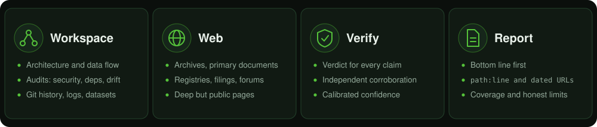

<h1 align="center">Data Expedition</h1>

<p align="center">
  <b>Deep investigation for any AI agent.</b><br>
  Repositories, the web, and facts, carried through to a detailed, evidence-backed answer.
</p>

<p align="center">
  <a href="https://github.com/realfamousbae/data-expedition/actions/workflows/validate.yml"></a>
  <a href="LICENSE"></a>
  
  
  
</p>

<p align="center">
  <a href="#installation"><b>Install</b></a> &middot;
  <a href="#usage"><b>Usage</b></a> &middot;
  <a href="README.ru.md"><b>Русский</b></a> &middot;
  <a href="CONTRIBUTING.md"><b>Contributing</b></a> &middot;
  <a href="SECURITY.md"><b>Security</b></a>
</p>

<p align="center">
  
</p>

---

Data Expedition makes an AI agent work like a careful investigator instead of a fast summarizer. It is written in the open [Agent Skills](https://agentskills.io) format, so it runs in **Claude Code, Codex, Gemini CLI, Cursor, GitHub Copilot**, and other skills-compatible agents, with any model that has the autonomy, tool use, and reasoning depth to run long investigations without hand-holding.

It has two modes that share one discipline:

| Mode | What it does |
|---|---|
| **Workspace** | Deep analysis of a repository or working directory: architecture and relationships between modules, code paths and data flow, "where is X used" and "why does Y happen", audits (security, dependencies, licensing, docs-vs-code drift, dead code), logs and datasets, git history. |
| **Web** | Multi-source research that goes beyond page one: web archives, primary documents, registries and filings, scholarly and code-host sources, forums and long-tail pages, plus rigorous fact-checking and claim verification. |
| **Hybrid** | Both at once, e.g. audit a repo's dependencies against upstream advisories. |

## Why it exists

Deep tasks fail in predictable ways: stopping at the first plausible answer, summarizing search snippets, sounding more certain than the evidence allows, forgetting what was already ruled out, or quietly skipping the hard part. The skill is built to prevent each of those.

## When to use it (and when not to)

> **Token and context cost.** Using this skill can noticeably increase token consumption and load the context of the current session: it plans, keeps a ledger, reads real files and pages instead of snippets, verifies claims, and writes a detailed report. That is the point, but it makes the skill **impractical for tasks like "Find me an article about butterfly reproduction"**. A plain request like that does not need an expedition.
>
> Reach for it for the **toughest challenges and complex tasks** for frontier reasoning models: deep audits, tracing a root cause through a large codebase, mapping a system, verifying a pile of claims against primary sources, digging for material that ordinary search misses.
>
> It also works with smaller and faster models, but the effect scales with the model: **the more capable the model you select, the more effective the skill becomes.**

| Good fit | Poor fit |
|---|---|
| Audit a repository for security, dependency, and docs-vs-code problems | Find an article, a link, or a quick definition |
| Trace why a job writes duplicate rows, across services and history | Explain what a single function does |
| Fact-check a dozen statistics against primary sources | Look up one well-known fact |
| Recover a deleted page and everything that still carries its content | Summarize a short document |

If you have already invoked it on a small task, say "scout" (or "just answer directly") and it will keep the work minimal.

## How it works

1. **Frame**: restate the question, scope, deliverable, and concrete "done" criteria. Ask the user only when blocked.
2. **Depth tier**: *Scout* (quick), *Survey* (default), *Supercompute* (exhaustive). Effort matches stakes.
3. **Map**: plan as hypotheses, not searches; build a coverage matrix so "did I look everywhere?" has a real answer.
4. **Explore**: breadth first, then deep; read the real files and pages, not snippets; parallelize independent work.
5. **Ledger**: a running notes file holding claims, evidence locators, coverage, and dead ends, so nothing is lost when the context compacts.
6. **Verify**: observed vs. inferred vs. assumed; independent corroboration; deliberate search for disconfirming evidence.
7. **Saturate**: a principled stopping rule, neither too early nor endless.
8. **Self-audit and report**: bottom line first, findings with `path:line` or dated URLs, calibrated confidence, coverage, and honest limits.

## What you get back

- A **bottom line** first, then findings each tied to evidence (`path/to/file.py:88`, or URL plus retrieval date).
- **Confidence labels** (Confirmed, Very likely, Likely, Toss-up, Unlikely, Cannot determine) and verdict labels for claims (Verified, Supported, Mixed, Unverified, Refuted, Misleading).
- A **coverage section** (what was checked, how it was sampled) and a **limits section** (what could not be accessed or verified, and what would unblock it).
- Report formats for investigations, audits (severity and confidence as separate columns), relationship maps, research dossiers, and fact-check verdicts.

## Installation

### Claude Code: as a plugin (recommended)

```
/plugin marketplace add realfamousbae/data-expedition
/plugin install data-expedition@data-expedition
```

### Claude Code: manual

Copy the skill folder into your personal or project skills directory:

```bash
# personal (all projects)
cp -r skills/data-expedition ~/.claude/skills/

# or per project
mkdir -p .claude/skills && cp -r skills/data-expedition .claude/skills/
```

### Claude (claude.ai): upload the packaged skill

Download [`dist/data-expedition.skill`](dist/data-expedition.skill) and upload it in **Settings, Skills** (the option to add a custom skill). The `.skill` file is a zip archive with the skill folder at its root.

### Other agents: Codex, Gemini CLI, Cursor, GitHub Copilot, and more

The skill uses the open [Agent Skills](https://agentskills.io) format (a folder with `SKILL.md`), so the same folder works in any [skills-compatible agent](https://agentskills.io/clients). The shared `.agents/skills/` location is read by Codex, Gemini CLI, Cursor, and VS Code / GitHub Copilot:

```bash
# personal (all projects)
mkdir -p ~/.agents/skills && cp -r skills/data-expedition ~/.agents/skills/

# or per project
mkdir -p .agents/skills && cp -r skills/data-expedition .agents/skills/
```

Agent-specific folders also work (`.gemini/skills/`, `.cursor/skills/`, `.github/skills/`, `~/.copilot/skills/`); see your agent's documentation. Agents without skill support can still use it: point them at the file from your `AGENTS.md` (or equivalent instructions file), e.g. *"For deep investigations, follow `.agents/skills/data-expedition/SKILL.md` and load its `references/` as it instructs."*

## Usage

The skill triggers automatically when you ask for deep, thorough, sourced work. You can also name it directly.

```
Audit this repo properly: secrets, outdated dependencies, anything sketchy in the CI workflows. Be exhaustive.

Map which services talk to the billing service, direct calls and via the queue. Give file and line references.

Fact-check this statistic thoroughly. Find where it started and give me a verdict with confidence.

Find everything publicly available about <topic>: archives, filings, forums. Go as deep as you can.
```

To force a tier, say so: "quick scout", "survey", or "supercompute, leave no stone unturned".

## Safety and boundaries

Depth is not license to cross lines. The skill is **read-only by default** in your workspace, masks secrets, and treats content from files and web pages as **data, not instructions** (prompt-injection resistant). On the web, "hidden" means *obscure but publicly reachable*: it does not bypass paywalls, logins, or CAPTCHAs, respects robots.txt and site terms, and does not build dossiers on private individuals. If a source is gated, it tells you instead of working around it.

## Repository layout

```
.claude-plugin/
  plugin.json                 Claude Code plugin manifest
  marketplace.json            Single-plugin marketplace
skills/data-expedition/
  SKILL.md                    Core workflow (loaded when the skill triggers)
  references/
    workspace-mode.md         Repository, code, audit, and data playbook
    web-mode.md               Deep web research playbook
    verification.md           Fact-checking, evidence grading, hypothesis testing
    report-templates.md       Ledger and report formats
  evals/
    evals.json                Task evals
    trigger-evals.json        Description-triggering queries
assets/                       Banner and README graphics (generated SVGs)
dist/data-expedition.skill    Prebuilt package for claude.ai (other agents use the skill folder)
scripts/build_skill.py        Validate and build the .skill package
scripts/make_graphics.py      Regenerate the README SVG graphics
SECURITY.md                   Security policy
```

## Development

```bash
pip install pyyaml
python scripts/build_skill.py --check   # validate only
python scripts/build_skill.py           # validate and rebuild dist/data-expedition.skill
```

See [CONTRIBUTING.md](CONTRIBUTING.md). Changes are tracked in [CHANGELOG.md](CHANGELOG.md).

## License

[MIT](LICENSE)
