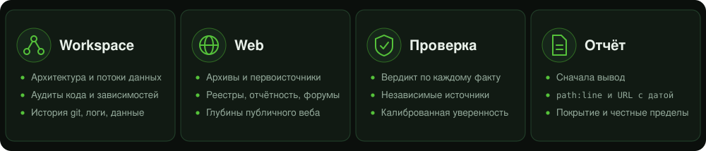

<h1 align="center">Data Expedition</h1>

<p align="center">
  <b>Глубокое расследование для любого ИИ-агента.</b><br>
  Репозитории, веб и факты: до подробного ответа с доказательствами.
</p>

<p align="center">
  <a href="https://github.com/realfamousbae/data-expedition/actions/workflows/validate.yml"></a>
  <a href="LICENSE"></a>
  
  
  
</p>

<p align="center">
  <a href="#установка"><b>Установка</b></a> &middot;
  <a href="#использование"><b>Использование</b></a> &middot;
  <a href="README.md"><b>English</b></a> &middot;
  <a href="CONTRIBUTING.md"><b>Contributing</b></a> &middot;
  <a href="SECURITY.md"><b>Безопасность</b></a>
</p>

<p align="center">
  
</p>

---

Data Expedition заставляет ИИ-агента работать как внимательный исследователь, а не как быстрый «пересказчик». Skill написан в открытом формате [Agent Skills](https://agentskills.io), поэтому работает в **Claude Code, Codex, Gemini CLI, Cursor, GitHub Copilot** и других агентах с поддержкой skills — с любой моделью, у которой достаточно автономности, навыков работы с инструментами и глубины рассуждений, чтобы вести долгие расследования без подсказок.

Два режима с единой дисциплиной:

| Режим | Что делает |
|---|---|
| **Workspace** | Глубокий анализ репозитория или рабочей папки: архитектура и связи между модулями, пути выполнения кода и потоки данных, вопросы «где используется X» и «почему происходит Y», аудиты (безопасность, зависимости, лицензии, расхождения документации и кода, мёртвый код), логи и датасеты, история git. |
| **Web** | Исследование по многим источникам за пределами первой страницы выдачи: веб-архивы, первоисточники, реестры и отчётность, научные и кодовые площадки, форумы и «длинный хвост» сайтов, а также строгая проверка фактов и утверждений. |
| **Hybrid** | Оба режима вместе, например аудит зависимостей репозитория по официальным бюллетеням уязвимостей. |

## Зачем это нужно

Глубокие задачи проваливаются предсказуемо: останавливаются на первом правдоподобном ответе, пересказывают сниппеты поиска, звучат увереннее, чем позволяют доказательства, забывают, что уже исключено, или молча пропускают самую трудную часть. Skill построен так, чтобы предотвращать каждую из этих ошибок.

## Когда использовать (и когда нет)

> **Расход токенов и нагрузка на контекст.** Использование skill может повысить потребление токенов и нагрузить контекст текущей сессии: он планирует, ведёт журнал, читает настоящие файлы и страницы вместо сниппетов, проверяет утверждения и пишет подробный отчёт. В этом и смысл, но поэтому запускать skill для задач уровня **«Найди мне статью про размножение бабочек» нецелесообразно** — такой простой запрос не требует экспедиции.
>
> Он пригодится для самых **«toughest challenges» и «complex tasks»** для frontier-моделей с сильным мышлением: глубокие аудиты, поиск первопричины в большой кодовой базе, карта системы, проверка множества утверждений по первоисточникам, поиск материалов, которые обычный поиск не находит.
>
> С более лёгкими и быстрыми моделями тоже подойдёт, но **эффективность становится выше, чем выше выбрана модель.**

| Подходит | Не подходит |
|---|---|
| Аудит репозитория: безопасность, зависимости, расхождения документации и кода | Найти статью, ссылку или краткое определение |
| Выяснить, почему задача пишет дубликаты строк, через несколько сервисов и историю | Объяснить, что делает одна функция |
| Проверить дюжину статистических данных по первоисточникам | Узнать один общеизвестный факт |
| Восстановить удалённую страницу и всё, где сохранилось её содержимое | Пересказать короткий документ |

Если skill уже запущен на мелкой задаче, скажите «scout» (или «просто ответь напрямую») — работа будет сведена к минимуму.

## Как это работает

1. **Рамка**: переформулировать вопрос, границы, формат результата и конкретные критерии «готово». Вопросы пользователю — только если без них не обойтись.
2. **Уровень глубины**: *Scout* (быстро), *Survey* (по умолчанию), *Supercompute* (исчерпывающе). Усилия соответствуют ставкам.
3. **Карта**: план в виде гипотез, а не поисковых запросов; матрица покрытия, чтобы на вопрос «везде ли я посмотрел?» был настоящий ответ.
4. **Исследование**: сначала вширь, потом вглубь; читать настоящие файлы и страницы, а не сниппеты; независимую работу распараллеливать.
5. **Журнал (ledger)**: рабочий файл заметок с утверждениями, ссылками на доказательства, покрытием и тупиками, чтобы ничего не терялось при сжатии контекста.
6. **Проверка**: наблюдаемое, выведенное и предполагаемое — отдельно; независимое подтверждение; намеренный поиск опровергающих свидетельств.
7. **Насыщение**: осмысленное правило остановки — не слишком рано и не бесконечно.
8. **Самоаудит и отчёт**: вывод в начале, находки со ссылками `path:line` или URL с датой, откалиброванная уверенность, покрытие и честные ограничения.

## Что вы получаете

- **Вывод** в начале, затем находки, каждая со ссылкой на доказательство (`path/to/file.py:88` либо URL и дата получения).
- **Уровни уверенности** (Confirmed, Very likely, Likely, Toss-up, Unlikely, Cannot determine) и **вердикты** по утверждениям (Verified, Supported, Mixed, Unverified, Refuted, Misleading).
- Раздел **покрытия** (что проверено и как выбиралась выборка) и раздел **ограничений** (что не удалось получить или проверить и что помогло бы).
- Форматы отчётов: расследование, аудит (серьёзность и уверенность — отдельные колонки), карта связей, досье по веб-исследованию, вердикт фактчека.

## Установка

### Claude Code: как плагин (рекомендуется для Claude Code)

```
/plugin marketplace add realfamousbae/data-expedition
/plugin install data-expedition@data-expedition
```

### Claude Code: вручную

Скопируйте папку skill в личную или проектную директорию skills:

```bash
# личная (для всех проектов)
cp -r skills/data-expedition ~/.claude/skills/

# или в конкретный проект
mkdir -p .claude/skills && cp -r skills/data-expedition .claude/skills/
```

### Claude (claude.ai): загрузка готового пакета

Скачайте [`dist/data-expedition.skill`](dist/data-expedition.skill) и загрузите его в **Settings, Skills** (добавление собственного skill). Файл `.skill` — это zip-архив с папкой skill в корне.

### Другие агенты: Codex, Gemini CLI, Cursor, GitHub Copilot и другие

Skill использует открытый формат [Agent Skills](https://agentskills.io) (папка с `SKILL.md`), поэтому одна и та же папка работает в любом [агенте с поддержкой skills](https://agentskills.io/clients). Общую директорию `.agents/skills/` читают Codex, Gemini CLI, Cursor и VS Code / GitHub Copilot:

```bash
# личная (для всех проектов)
mkdir -p ~/.agents/skills && cp -r skills/data-expedition ~/.agents/skills/

# или в конкретный проект
mkdir -p .agents/skills && cp -r skills/data-expedition .agents/skills/
```

Подходят и собственные папки агентов (`.gemini/skills/`, `.cursor/skills/`, `.github/skills/`, `~/.copilot/skills/`) — смотрите документацию своего агента. Агенту без поддержки skills можно указать файл в `AGENTS.md` (или аналогичном файле инструкций), например: *«Для глубоких расследований следуй `.agents/skills/data-expedition/SKILL.md` и подгружай его `references/`, как там описано»*.

## Использование

Skill срабатывает автоматически, когда вы просите глубокую, тщательную работу с источниками. Можно также вызвать его по имени.

```
Проведи полноценный аудит репозитория: секреты, устаревшие зависимости, подозрительное в CI. Исчерпывающе.

Покажи, какие сервисы обращаются к биллингу — напрямую и через очередь. Дай ссылки на файлы и строки.

Тщательно проверь эту статистику. Найди, откуда она взялась, и дай вердикт с уровнем уверенности.

Найди всё, что публично известно про <тема>: архивы, отчётность, форумы. Копай как можно глубже.
```

Чтобы задать уровень, скажите прямо: «быстро, scout», «survey» или «supercompute, ничего не упусти».

## Безопасность и границы

Глубина не даёт права переступать границы. По умолчанию skill работает **только на чтение** в вашем рабочем пространстве, маскирует секреты и относится к содержимому файлов и веб-страниц как к **данным, а не инструкциям** (устойчивость к prompt injection). В вебе «скрытое» означает *малоизвестное, но публично доступное*: skill не обходит пейволлы, логины и CAPTCHA, соблюдает robots.txt и условия сайтов и не собирает досье на частных лиц. Если источник закрыт, он сообщит вам об этом, а не станет искать обходной путь.

## Структура репозитория

```
.claude-plugin/
  plugin.json                 Манифест плагина Claude Code (другим агентам нужна только skills/)
  marketplace.json            Маркетплейс из одного плагина
skills/data-expedition/
  SKILL.md                    Основной рабочий процесс (загружается при срабатывании)
  references/
    workspace-mode.md         Репозиторий, код, аудиты, данные
    web-mode.md               Глубокое веб-исследование
    verification.md           Фактчекинг, оценка доказательств, проверка гипотез
    report-templates.md       Форматы журнала и отчётов
  evals/
    evals.json                Тестовые задачи
    trigger-evals.json        Запросы для проверки срабатывания описания
assets/                       Баннер и графика README (генерируемые SVG)
dist/data-expedition.skill    Готовый пакет для claude.ai (другим агентам нужна папка skill)
scripts/build_skill.py        Валидация и сборка пакета .skill
scripts/make_graphics.py      Пересборка SVG-графики README
SECURITY.md                   Политика безопасности
```

## Разработка

```bash
pip install pyyaml
python scripts/build_skill.py --check   # только валидация
python scripts/build_skill.py           # валидация и пересборка dist/data-expedition.skill
```

См. [CONTRIBUTING.md](CONTRIBUTING.md). История изменений — в [CHANGELOG.md](CHANGELOG.md).

## Лицензия

[MIT](LICENSE)
